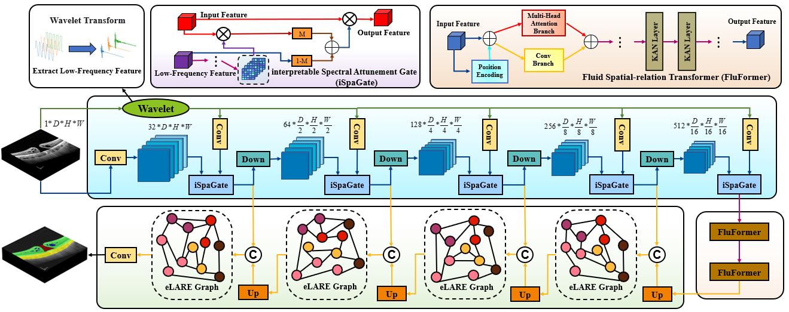

# Spectral-Spatial Modulation and Nonlinear Relational Projection for Multi-Scale Morphological Delineation Enhancing in Complex OCT Macular Pathologies

## Detailed network structure of the SF-ProNet

  

Structural depiction of the SF-ProNet, comprising an encoding branch bifurcated into a spatial-domain encoder and a wavelet transform-based low-frequency feature extraction pathway, interconnected via SpaGate facilitating selective spectral-spatial fusion; a bottleneck stage characterized by dual consecutive FluFormer module designed for simultaneous global-local feature modeling; and a decoding branch structured by four successive upsampling processes, each followed by a LARE Graph dynamically refining inter-channel dependencies to enhance granularity of reconstructed segmentation features.

## Installation

Initial learning rates are uniformly set at 0.0001, with batch sizes standardized to 1 across all models.The experiments are conducted on a computational platform equipped with dual NVIDIA GeForce RTX 4080 Super GPUs. The software environment comprises Python 3.11, PyTorch 2.4.0, and CUDA 12.1.  All training and evaluations are executed under consistent hardware and software configurations to ensure reproducibility and fairness.
