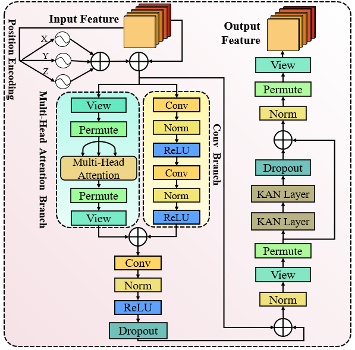

# Spectral-Spatial Modulation and Nonlinear Relational Projection for Explainable Multi-Scale Morphological Delineation Enhancing in Complex OCT Macular Pathologies

## Detailed network structure of the SF-ProNet

  

Structural depiction of the SF-ProNet, comprising an encoding branch bifurcated into a spatial-domain encoder and a wavelet transform-based low-frequency feature extraction pathway, interconnected via iSpaGate facilitating selective spectral-spatial fusion; a bottleneck stage characterized by dual consecutive FluFormer module designed for simultaneous global-local feature modeling; and a decoding branch structured by four successive upsampling processes, each followed by a eLARE graph dynamically refining inter-channel dependencies to enhance granularity of reconstructed segmentation features.

## Detailed Key component structure of the iSpaGate

  

The schematic representation illustrates the proposed iSpaGate, wherein spatial-domain input features and low-frequency components de-rived via discrete wavelet transformation are concurrently utilized; the low-frequency spectrum is subjected to convolutional processing and nonlinear activation to produce a spatial attention map, subsequently modulating the spatial-domain representation through element-wise multiplication, and further adaptively integrated through trainable parameters, resulting in refined output features via multiplication with the original spatial-domain input.

## Detailed Key component structure of the FluFormer

  

The schematic depiction of the proposed FluFormer architecture, wherein the input features undergo spatial encoding independently along the x, y, and z spatial dimensions, incorporated into the feature embedding space; encoded representations are concurrently propagated through parallel multi-head self-attention and convolutions for global and localized feature extraction, respectively, followed by a fusion mechanism facilitating cross-branch integration. Moreover, the feedforward pathway integrates KAN layers to augment nonlinear representational capacity, enhancing the expressiveness of higher-order interactions inherent in complex pathological structures.

## Detailed Key component structure of the eLARE Graph.

  

The proposed eLARE graph, by computing spatially aggregated mean vectors across each channel and dynamically constructing an inter-channel similarity graph to effectively capture cross-channel correlations, integrates graph convolution and dynamic channel modeling strategies, thereby facilitating enhanced feature representation and detailed spatial recovery in OCT segmentation tasks.

## Installation

Initial learning rates are uniformly set at 0.0001, with batch sizes standardized to 1 across all models.The experiments are conducted on a computational platform equipped with dual NVIDIA GeForce RTX 4080 Super GPUs. The software environment comprises Python 3.11, PyTorch 2.4.0, and CUDA 12.1.  All training and evaluations are executed under consistent hardware and software configurations to ensure reproducibility and fairness.

## Experiment

  

